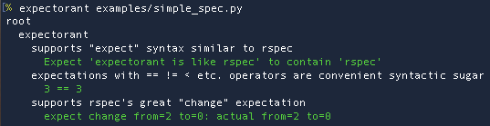

Expectorant - RSpec for Python
==============================

A testing framework for Python 3.5 or later in the style of Ruby's RSpec.  Here
are the prominent features:

* __Readable code__ --- Expectorant's syntax is easier to read than `unittest` and
  descriptions of intent are more prominent.  No more functions named `test_my_function_with_special_condition_x`
  Instead situations and descriptions of the expected behavior are easy-to-read strings.

* __Nested before/after functions__ --- Often there is common setup for a class, some specific setup for
  tests of a method, and more specific setup for a edge-cases.  Expectorant organizes
  tests hierarchically to readably express your test structure.

* __Repeat a test with different data__ --- Have you ever found yourself repeating test code over and over with
  just different data? E.g. square(1) == 1, square(2) == 4?  Wouldn't it be clearer to pass in different data to the same test?
  ```
  input output
  ----- ------
  1     1
  2     4
  ```
  Expectorant's `it` clause can take a table (2D sequence) and the test is repeated over the rows.
  
* __Simple custom matchers__ --- Matcher functions to compare you specific data types
  are only a few lines long.

* __A failing check does not abort the test__ --- `unittest` and RSpec use
  assertions to signal a failure. Expectorant does not which means one test
  case can check several outputs and can show several failures.  This was an
  intentional part of Unittest's design---you don't want side effects from one
  expectation distorting the results of another expectation.  But we are all
  adults here---the programmer should be able to decide for herself when that is necessary.  E.g. if
  you are only checking the contents of an immutable return value, there is no
  need run the subject over and over---the output is going to be the same in
  each run.

* __Easy to modify output__ --- Currently there is one output format, but other
  formats such as JUnit XML for integration with CI servers would be easy.

A simple example of Expectorant style test:

```python
from expectorant import *

@describe('expectorant')                                    # what is being specified in this file?
def _():                                                    # this line is a bit ugly but not too bad.
    scope = None
    @before
    def _():
        nonlocal scope
        scope = Scope()                                     # A new scope every test run
        scope.dict = {'a': 'expectorant is like rspec', 'b': 3}

    @it('supports "expect" syntax similar to rspec')
    def _():
        expect(scope.dict['a']).to(contain, 'rspec')        # expectations are similar to RSpec.
                                                            # `contain` is just a matcher function.
    @it('expectations with == != < etc. operators are convenient syntactic sugar')
    def _():
        expect(scope.dict['b']) == 3

    @it('supports rspec\'s great "change" expectation')
    def _():
        expect(scope.dict.clear).to(change, lambda: len(scope.dict), frm=2, to=0)
```

Run all your specs from the command line, e.g. `expectorant [filename | directory]`,
or from a Python script:

```python
import expectorant
expectorant.main(dirs_or_filenames_to_test)
```

The output looks like this:



Also, if you or your child wants to learn electricity, try my game
Electropocalyse at http://stratolab.com/electropocalypse

Requirements
------------
* Python 3.5 --- we use: importlib.util.module_from_spec

Installation
------------

```
pip3 install git+https://github.com/winstonwolff/expectorant/
```

